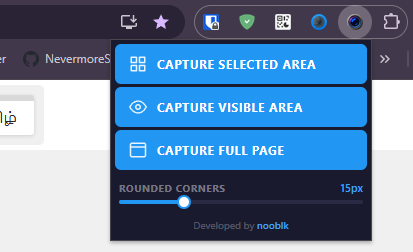

<p align="center">
  
</p>

<h1 align="center">QuickShot</h1>

<p align="center">A lightweight Chrome extension for fast, precise screenshots. Capture visible area, full page, or a custom-selected region in one click.</p>

<p align="center">
  
</p>

---

## Features

- **Capture Selected Area**: drag to select any region on screen. The last selection is remembered and shown pre-drawn next time so you can reuse the same size across multiple pages. Drag the box to reposition it, or draw a new one.
- **Capture Visible Area**: screenshots the current viewport instantly.
- **Capture Full Page**: stitches the entire scrollable page into one image.
- **Rounded Corners**: apply a corner radius to any capture.
- **Auto save + clipboard**: every screenshot is downloaded and copied to clipboard simultaneously.

---

## Installation

1. Clone or download this repository.
2. Open Chrome and go to `chrome://extensions`.
3. Enable **Developer mode** (top right toggle).
4. Click **Load unpacked** and select the project folder.
5. The QuickShot icon will appear in your toolbar.

---

## Usage

Click the extension icon to open the menu.

| Button | What it does |
|---|---|
| **Capture Selected Area** | Opens an overlay. Drag to draw a selection. Previous selection is pre-shown; drag the box to move it or drag outside to draw a new one. Press **Enter** or click the capture button to shoot. Press **ESC** to cancel. |
| **Capture Visible Area** | Captures the current viewport immediately. |
| **Capture Full Page** | Scrolls and stitches the full page into one PNG. |

The **Rounded Corners** slider applies a corner radius to all capture types and is saved between sessions.

---

## Output

Every capture is:
- **Downloaded** as a `.png` file automatically.
- **Copied to clipboard** so you can paste directly into any app.

---

## Project Structure

```
QuickShot/
├── src/
│   ├── background/
│   │   └── background.js     # Service worker: handles capture, download, clipboard
│   ├── content/
│   │   └── content.js        # Injected script: area selection overlay, full-page stitching
│   ├── popup/
│   │   ├── popup.html        # Extension popup UI
│   │   ├── popup.css         # Popup styles
│   │   └── popup.js          # Popup logic
│   └── icons/
│       ├── icon16.png
│       ├── icon48.png
│       └── icon128.png
└── manifest.json
```

---

## Requirements

- Chrome 116+ (Manifest V3)
- No external dependencies

---

## License

MIT
